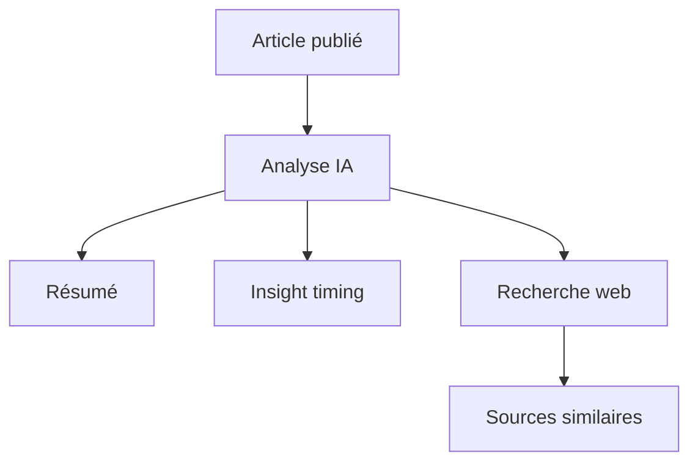

# 🚀 NadsTech – Le blog tech boosté à l'IA

**NadsTech** est un blog nouvelle génération propulsé par **Blazor Server**, intégrant des fonctionnalités d'intelligence artificielle via **OpenRouter** pour enrichir l'expérience de lecture tech.

> 🧠 "Un blog tech qui pense avec vous."

---

## 🧩 Fonctionnalités clés

- 📝 Création et lecture d’articles tech
- 🤖 **Interaction avec IA (LLMs)** : questionnez les articles
- 🧠 Résumés IA + exploration web contextuelle
- 📊 **Insights dynamiques** : graphiques, tendances, timing optimal
- 🔗 Articles similaires (web & interne)
- 💬 Commentaires, réactions, partages sociaux
- 🌗 UI moderne avec thème clair/sombre (Dark Mode)

---

## 🛠️ Stack Technique

| Composant         | Techno                           |
|-------------------|----------------------------------|
| Frontend UI       | Blazor Server + MudBlazor        |
| IA / NLP          | OpenRouter (GPT, Claude, etc.)   |
| Base de données   | SQLite (dév) / PostgreSQL (prod) |
| Scraping web      | AngleSharp + HttpClient (.NET)   |
| Visualisation     | Chart.js (via JSInterop)         |
| Authentification  | ASP.NET Core Identity            |
| Design responsive | Tailwind CSS / MudBlazor         |

---

## 🧠 Architecture Fonctionnelle

```text
+--------------------+
|    Utilisateur     |
+--------------------+
         |
         v
+---------------------------+
| Interface Blazor (UI/UX) |
+---------------------------+
         |
         v
+-------------------------+
| Services .NET (C#)     |
| - IA (OpenRouter)      |
| - Scraping Web         |
| - Articles & Comments  |
| - Stats & Insights     |
+-------------------------+
         |
         v
+--------------------+     +---------------------+
| Base de Données    | <-- | Cache (Redis/Memory)|
+--------------------+     +---------------------+
```

## 🚀 Lancer NadsTech en local

🔧 Prérequis
	•	.NET 8 SDK
	•	Node.js (si usage Tailwind)
	•	Clé API OpenRouter

## 📈 Exemple d’insight IA (diagramme)



